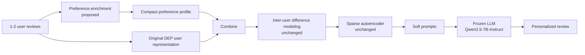

# Improving LLM Personalization under Cold-Start Conditions using Latent Inter-User Difference Modeling

**Cold-start extension of DEP (Difference-aware Embedding-based Personalization).**
Controlled limited-history evaluation (1 / 2 / 5 reviews) plus a lightweight preference-enrichment module for users with very little history.

> Built on the official implementation of
> [*Latent Inter-User Difference Modeling for LLM Personalization*](https://arxiv.org/abs/2507.20849) (Qiu et al., EMNLP 2025) —
> [github.com/SnowCharmQ/DEP](https://github.com/SnowCharmQ/DEP). All credit for DEP, its dataset pipeline and released model belongs to the original authors.


---

## Table of contents
1. [Motivation](#1-motivation)
2. [Method](#2-method)
3. [Repository layout](#3-repository-layout)
4. [Setup](#4-setup)
5. [Usage](#5-usage)
6. [Experimental design](#6-experimental-design)
7. [Results](#7-results)
8. [Design decisions and fixes over the official pipeline](#8-design-decisions-and-fixes-over-the-official-pipeline)
9. [Testing](#9-testing)
10. [Limitations](#10-limitations)
11. [Team](#11-team)
12. [Acknowledgements and citation](#12-acknowledgements-and-citation)

---

## 1. Motivation

DEP personalizes a frozen LLM by contrasting a user's review embeddings with those of peers who reviewed the same items, compressing the signals with a sparse autoencoder (SAE) and injecting them as soft prompts.
The DEP paper identifies a limitation: it relies on sufficient user history, and quality can degrade for **cold-start / data-sparse** users.

Real systems cannot assume every user has a long history. This project asks:

> **How can DEP-based personalization be improved when a user has only one or two previous reviews?**

The DEP paper already varies the number of retrieved histories, so simply reporting K = 1 or 2 is *not* the contribution. We use limited-history evaluation to define the cold-start setting, then add a preference-enrichment stage designed for it, **without** replacing DEP's inter-user difference modeling.

## 2. Method



### Preference enrichment (`coldstart/enrich.py`)
A deterministic, CPU-only, rule-based extractor (no extra LLM, no paid API). From the available reviews it produces a short profile:

```
[User Preference Profile]:
- Genre/theme preference: science fiction
- Liked aspects: complex storyline
- Rating tendency: mostly highly positive (average 4.5/5)
- Writing style: brief (about 5 words per review)
```

It combines sentence-level polarity (small lexicon, negation handling, rating prior), aspect mining (plot, characters, acting, music, pacing, …), descriptors ("complex storyline") and per-category genre cues from item metadata (Books / Movies & TV / CDs & Vinyl).

### Three compared variants

| Variant | What changes relative to DEP |
|---|---|
| `orig` | DEP exactly as released, but only the K most recent reviews are available |
| `enrich_text` | `orig` + the preference profile appended to the prompt |
| `enrich_blend` | `enrich_text` + the profile embedding (bge-m3) blended into the user representation **before** inter-user difference modeling: `rep = normalize(review_emb + α · profile_emb)` |

The released DEP model, its SAE weights and the downstream pipeline are **not retrained or modified**.

## 3. Repository layout

Copy this project's `coldstart/` and `tests/` folders into the **root of the official DEP repo** (or your fork of it).

```
DEP/                              <- official repo (unchanged)
├── embedding.py                  bge-m3 embeddings
├── create-dataset.py             official dataset builder (full history)
├── model-eval.py                 official evaluation
├── model/ data/ utils/ ...
├── coldstart/                    <- this project
│   ├── enrich.py                 preference-enrichment module
│   ├── build_coldstart.py        K-limited evaluation sets, 3 variants
│   ├── eval_coldstart.py         generation + metrics (ROUGE, METEOR, BLEU, BERTScore)
│   ├── make_table.py             results table with relative change
│   └── show_examples.py          qualitative side-by-side examples
└── tests/
    └── test_coldstart.py         CPU sanity tests on synthetic data
```

## 4. Setup

```bash
git clone https://github.com/SnowCharmQ/DEP.git      # or your fork
cd DEP
# copy coldstart/ and tests/ from this project into the repo root
bash install.sh      # official env: Python 3.11, forked vLLM (branch "dep"), transformers 4.51.3, ...
```

**Hardware.** The official model is Qwen2.5-7B-Instruct served in bf16 by a forked vLLM that allocates a fixed `(16, 1024)` embedding buffer per request.
A Colab **T4 is not sufficient** (no bf16 support, ~15 GB memory). Use an L4 / A100 / H100-class GPU. CPU-only is enough for the unit tests and for data building without the `enrich_blend` variant.

## 5. Usage

```bash
# 1. official preprocessing (embeddings of all test users)
python embedding.py

# 2. build cold-start sets (same users/targets/peers in every condition)
python -m coldstart.build_coldstart --ks 1 2 5 \
    --variants orig enrich_text enrich_blend --alpha 0.3 --limit 200

# 3. generate and score every condition
for K in 1 2 5; do for V in orig enrich_text enrich_blend; do
  python -m coldstart.eval_coldstart --category Books --k $K --variant $V --mode infer --limit 200
  python -m coldstart.eval_coldstart --category Books --k $K --variant $V --mode eval  --limit 200
done; done

# 4. full-history reference (official dataset; run `bash run-create.sh` first)
python -m coldstart.eval_coldstart --category Books --k full --mode infer --limit 200
python -m coldstart.eval_coldstart --category Books --k full --mode eval  --limit 200

# 5. report
python -m coldstart.make_table
python -m coldstart.show_examples --category Books --k 2 --n 5
```

Useful flags: `--limit N` (first N users per category — identical for all conditions), `--seed` (per-request sampling seed), `--temperature`, `--dtype`, `--max_model_len`, `--no_bertscore`.

Start small: `build_coldstart --ks 2 --variants orig enrich_text --limit 5` is a quick check that the pipeline works on the real data.

## 6. Experimental design

| Controlled factor | Setting |
|---|---|
| Dataset | DEP/DPL-derived Amazon Reviews'23: Books, Movies & TV, CDs & Vinyl |
| Users, target items, reference reviews | Identical in every condition |
| History available | Full (reference), 5, 2 and 1 most recent reviews |
| Base model | Released `SnowCharmQ/DEP-model` (frozen Qwen2.5-7B-Instruct + DEP modules) |
| Decoding | temperature 0.8, top-p 0.95, fixed per-request seed |
| Metrics | ROUGE-1, ROUGE-L, METEOR, BLEU, BERTScore |

Principal comparisons: **Original DEP + 1 review vs Modified DEP + 1 review** and **Original DEP + 2 reviews vs Modified DEP + 2 reviews**, with full-history and 5-review conditions as reference points and `orig` vs `enrich_text` vs `enrich_blend` as an ablation of the enrichment component.

## 7. Results

> **Status: pending.** The implementation is complete and sanity-tested on synthetic data. Measured results on the real dataset and model have **not** been produced yet. No improvement is claimed before experiments are run. Cells are filled only with values measured by `coldstart/eval_coldstart.py`.

| Method | History | METEOR | BLEU | ROUGE-1 | BERTScore |
|---|---|---|---|---|---|
| Original DEP | Full | – | – | – | – |
| Original DEP | 5 reviews | – | – | – | – |
| Original DEP | 2 reviews | – | – | – | – |
| Modified DEP (text) | 2 reviews | – | – | – | – |
| Modified DEP (text + blend) | 2 reviews | – | – | – | – |
| Original DEP | 1 review | – | – | – | – |
| Modified DEP (text) | 1 review | – | – | – | – |
| Modified DEP (text + blend) | 1 review | – | – | – | – |

`python -m coldstart.make_table` regenerates this table (macro-averaged over the categories evaluated) together with the relative METEOR change versus the original at the same history size. When filling it in, state the sample size (`--limit`) next to the table.

## 8. Design decisions and fixes over the official pipeline

1. **No full-history leakage.** The official code weights peers using the target user's mean embedding over their *entire* profile. In a cold-start setting that would silently leak the withheld history. Here the mean is computed from the K available reviews only (covered by `test_no_full_history_leak`).
2. **Fixed 16 × 1024 layout.** The DEP vLLM fork replaces placeholder tokens by token id from a `(16, 1024)` buffer (rows 0–7 review embeddings, rows 8–15 difference embeddings). Histories with K < 8 are zero-padded and only K placeholder tokens appear in the prompt.
3. **Prompt/embedding alignment.** Review *i* in the prompt (the i-th most recent) always uses embedding row *i*. In the official dataset code the i-th prompt review and the i-th embedding can refer to different reviews when some recent reviews have no peers.
4. **Reviews without peers** get no difference token, rather than a zero vector the model never saw in training.
5. **Same system prompt in all variants.** Only the `[User Preference Profile]` block differs, keeping the comparison controlled.
6. **Reproducible sampling.** Each request has a fixed seed (the official evaluation has none).
7. **Peer maps** are built exactly as in the official `create-dataset.py` (test-split users, last two reviews excluded).

## 9. Testing

```bash
PYTHONPATH=. python tests/test_coldstart.py
```

CPU-only tests on synthetic data check: tensor shapes and zero-padding, token-to-row alignment, no information from reviews outside the K most recent, variant differences, prompt-length trimming, and the enrichment module on the example reviews (including negation).
These tests verify the logic of this extension; they are **not** an evaluation of model quality.

## 10. Limitations

- **Not yet evaluated on real data.** Quality effects of the enrichment are unknown and may be neutral or negative.
- The released DEP model was **not trained** with the profile block or with blended embeddings. The frozen LLM can read the extra text, but `enrich_blend` mixes a summary embedding with review embeddings the SAE never saw; treat it as an ablation.
- The enricher is lexicon-based: limited vocabulary, English only, no sarcasm handling, genre cues from simple patterns.
- Cold start is simulated by truncating the history of users who actually have longer histories; truly new users may differ.
- Depends on the forked vLLM and a large-memory GPU; not runnable on a free Colab T4.
- Relies on the assumption (also made by the official code) that each user's raw profile is time-ordered; the builder warns if it is not.

## 11. Team

| Member | Roll No. | Focus |
|---|---|---|
| M. Pranav Ram | B24DS016 | DEP reproduction, dataset analysis, limited-history sets, baseline experiments, metric analysis |
| M.S.V. Sairama | B24DS015 | Input/profile analysis, preference-enrichment implementation, modified experiments, ablation, comparison |

Joint: paper study, debugging, experimental design, result interpretation, report and presentation.
B.Tech Data Science and Artificial Intelligence, IIT Bhilai.

## 12. Acknowledgements and citation

This project builds on the official DEP and DPL code and data. Please cite the original work:

```bibtex
@article{qiu2025latent,
  title   = {Latent Inter-User Difference Modeling for LLM Personalization},
  author  = {Qiu, Yilun and Shi, Tianhao and Zhao, Xiaoyan and Zhu, Fengbin and Zhang, Yang and Feng, Fuli},
  journal = {arXiv preprint arXiv:2507.20849},
  year    = {2025}
}
```

- DEP: <https://github.com/SnowCharmQ/DEP> · DPL: <https://github.com/SnowCharmQ/DPL>
- Amazon Reviews'23: Hou et al., *Bridging Language and Items for Retrieval and Recommendation*, 2024.
- Embeddings: BAAI/bge-m3 · Base LLM: Qwen2.5-7B-Instruct.

Code in `coldstart/` and `tests/` is provided for academic coursework. Check the upstream repositories' licenses before redistributing anything derived from them.
